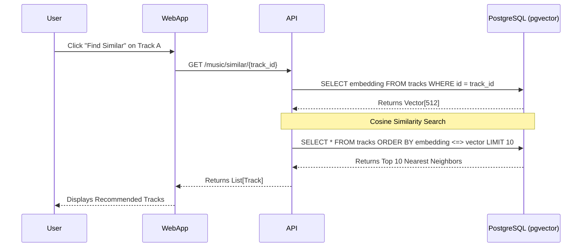
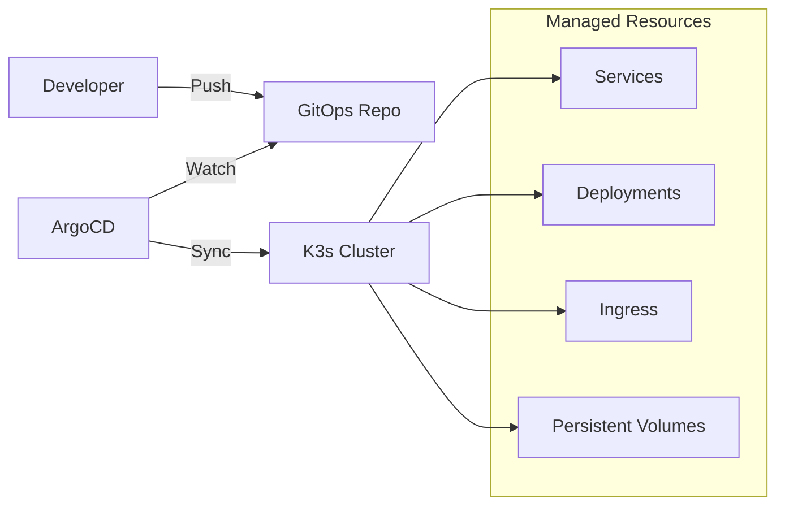

# MSV2 Architecture & Infrastructure

This document visualizes the architecture of the MSV2 Music Library project, showcasing the full-stack implementation on a K3s Kubernetes cluster.

## 1. System Context

High-level overview of how users interact with the system.

```mermaid
graph LR
    User((User))
    subgraph "K3s Cluster (Home Lab)"
        WebApp[MSV2 WebApp\n(React/Vite)]
        API[MSV2 API\n(FastAPI)]
        DB[(PostgreSQL\n+ pgvector)]
        MinIO[(MinIO\nObject Storage)]
    end

    User -->|HTTPS| WebApp
    WebApp -->|JSON/REST| API
    API -->|SQL| DB
    API -->|S3 Protocol| MinIO
    API -->|Vector Search| DB
```

## 2. Container Architecture (K3s)

Detailed view of the Kubernetes deployment and networking.

```mermaid
graph TB
    subgraph "K3s Cluster Nodes (3x Mini PCs)"
        Ingress[Nginx Ingress Controller]
        
        subgraph "Frontend Pods"
            WebPod[WebApp Pod]
        end
        
        subgraph "Backend Pods"
            APIPod[API Pod]
            WorkerPod[Worker Pod\n(Async Tasks)]
        end
        
        subgraph "Data Layer"
            Postgres[(PostgreSQL\nPrimary)]
            MinIOCluster[(MinIO\nDistributed)]
        end
    end

    Internet((Internet)) -->|HTTPS/443| Ingress
    Ingress -->|/api| APIPod
    Ingress -->|/| WebPod
    
    APIPod -->|Read/Write| Postgres
    APIPod -->|Store Audio| MinIOCluster
    WorkerPod -->|Process Audio| MinIOCluster
    WorkerPod -->|Update Embeddings| Postgres
```

## 3. Data Flow: Vector Similarity Search

Sequence of events for the "Similar Tracks" feature, highlighting the Data Science/AI integration.



## 4. Infrastructure as Code (GitOps)

Overview of the deployment pipeline.


