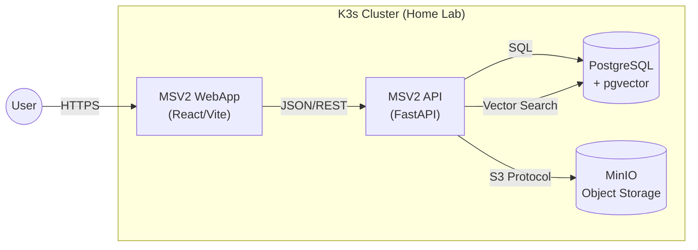
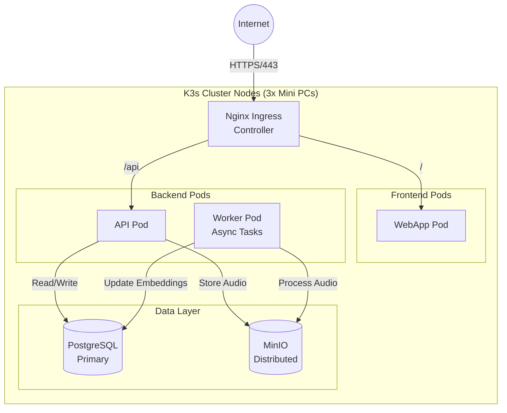
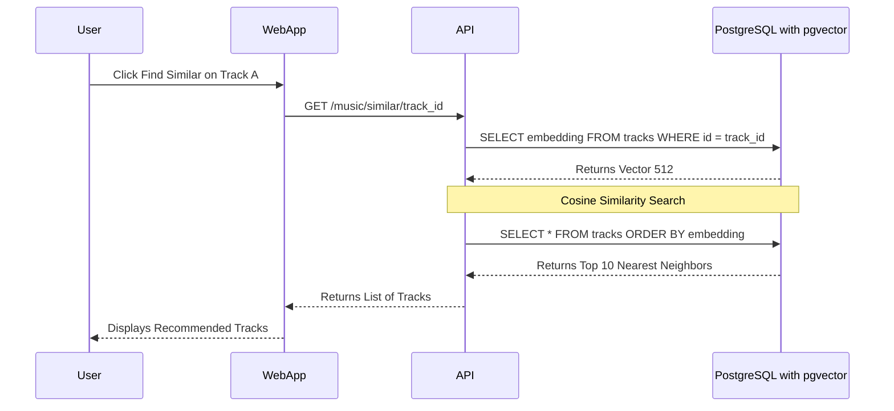
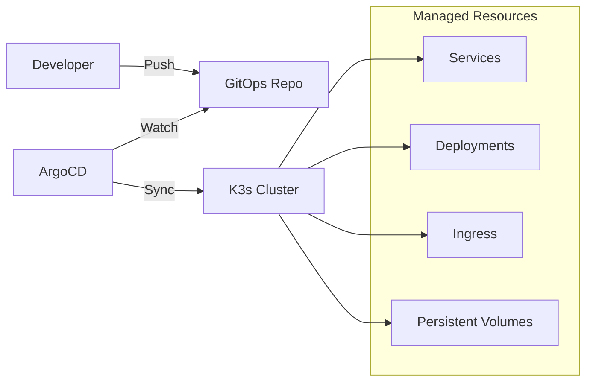

# MSV2 Architecture & Infrastructure

This document visualizes the architecture of the MSV2 Music Library project, showcasing the full-stack implementation on a K3s Kubernetes cluster.

## 1. System Context

High-level overview of how users interact with the system.

## 2. Container Architecture (K3s)

Detailed view of the Kubernetes deployment and networking.

## 3. Data Flow: Vector Similarity Search

Sequence of events for the "Similar Tracks" feature, highlighting the Data Science/AI integration.

## 4. Infrastructure as Code (GitOps)

Overview of the deployment pipeline.

## Key Architecture Highlights

**Frontend Layer**: React/Vite single-page application served through Nginx Ingress, providing responsive UI for music library management.

**Backend Layer**: FastAPI microservice handling business logic, REST endpoints, and vector similarity computations. Worker pods manage asynchronous tasks like audio processing and embedding generation.

**Data Layer**: PostgreSQL with pgvector extension enables semantic search by storing and querying audio embeddings. MinIO distributed object storage handles audio file management with S3-compatible API.

**Kubernetes Infrastructure**: K3s lightweight cluster running on 3 mini PCs provides container orchestration with Nginx ingress for external traffic routing and ArgoCD for GitOps-driven deployments.

**ML/AI Integration**: Vector embeddings stored in PostgreSQL enable semantic similarity search, allowing the system to find musically related tracks through cosine similarity computations.
